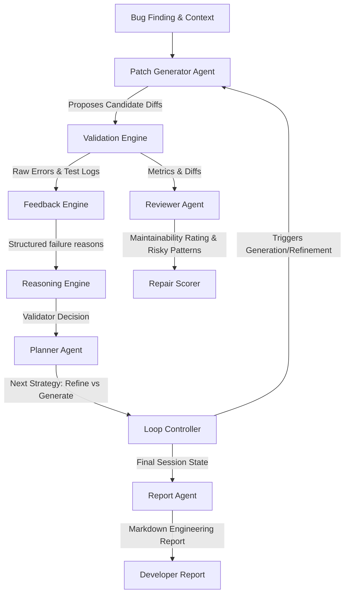

# Phase 3D.3 — Agent Interaction Model

The multi-agent architecture in ARGUS consists of specialized, cooperative LLM agents that coordinate to analyze, review, plan, and report code repairs.

## Agent Roles & Responsibilities

### 1. Validator Agent (ReasoningEngine + ValidatorAgent)
* **Input**: Validation metrics, compile errors, syntax errors, and regression test failures.
* **Output**: Identification of the specific file and function that caused the failure, lists of code elements that should remain unchanged (to prevent regressions), and actions to take to fix compilation/regression crashes.

### 2. Patch Generator Agent (`PatchGeneratorAgent`)
* **Input**: Bug finding details, codebase files, RAG documents, and planning strategies.
* **Output**: Generates a set of raw, syntactically style-preserved patch candidates using the 3D.1 engine.

### 3. Reviewer Agent (`ReviewerAgent`)
* **Input**: The proposed patch diff, reasoning summary, and bug description.
* **Output**: Ratings on maintainability (complexity, readability) and risk (thread-safety, pointer usage, casting) that penalize poor candidate structures.

### 4. Planner Agent (`PlannerAgent`)
* **Input**: Iteration history, score progression, past strategies, and current feedback.
* **Output**: Resolves whether to refine the best candidate, start from scratch with a higher temperature, switch to an alternative API approach, or stop the loop to prevent degradation.

### 5. Report Agent (`ReportAgent`)
* **Input**: Completed repair session logs, audit trails, and metrics statistics.
* **Output**: Formats a chronological engineering narrative summarizing scores, strategies used, candidate lineages, and selection rationales.
